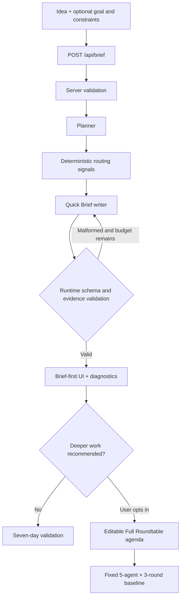

# AI Roundtable

[](https://github.com/96528025/ai-roundtable/actions/workflows/ci.yml)

> Turn a vague product idea into an evidence-aware pre-build decision.

**[Open the sample-only public demo](https://ai-roundtable-mu.vercel.app)** · [Review the committed evaluation baseline](evals/results/latest.json)

AI Roundtable helps a builder decide what deserves implementation before spending time on a polished product. The default experience is a bounded **Quick Brief**: the user describes an idea once, a Planner extracts the decision structure, and a brief writer returns an honest verdict, narrow MVP, technical direction, distribution hypothesis, monetization reality check, risks, and a seven-day validation plan.

The original five-agent, three-round workflow remains available as **Full Roundtable** and as an explicit evaluation baseline. It is no longer the default. In a five-case paired evaluation the structural rubric did not distinguish the fixed roundtable from a one-call control, while the fixed roundtable used 37.9× the tokens and 7.0× the wall-clock time in aggregate (38.1× and 7.1× as the mean of per-case ratios); see [the committed baseline and its caveats](#committed-legacy-paired-baseline), including the fact that the run is recorded against a dirty working tree.

## Product Modes

### Quick Brief — default

- One idea, with optional decision goal and constraints
- One Planner call plus one brief-writer call on the normal path
- Four-attempt hard budget shared by transport retries and malformed-output recovery
- Strict runtime validation for the complete V2 output contract
- A single primary verdict rather than automatic encouragement
- Explicit evidence boundaries: Milestone 1 does not perform external research
- Optional recommendation to escalate, never automatic paid Full execution

### Full Roundtable — optional legacy baseline

- Human-edited agenda with three to five topics
- Five fixed personas across three sequential rounds
- One moderator synthesis call
- Complete internal transcript and aggregate diagnostics
- Normally 16 logical calls after agenda approval

## Quick Brief Output

The V2 contract includes:

- idea summary
- calibrated initial verdict
- target user, problem, and current workaround
- evidence status and unanswered questions
- existing alternatives with explicit evidence basis
- differentiation opportunities
- recommended MVP and exclusions
- Web, PWA, native app, or no-build-yet recommendation
- suggested technical approach
- distribution and activation hypothesis
- monetization reality check
- material risks, assumptions, and cheap tests
- seven-day validation plan with decision thresholds
- one high-impact follow-up question

Milestone 1 deliberately sets `evidence.status` to `not_researched`. A no-research result cannot contain external sources, externally verified alternatives, evidence claims, or a high-confidence verdict. Inferences and assumptions must be labeled as such.

## Architecture



Key boundaries:

- **Attempt-aware budget:** Quick Brief normally uses two calls and can never exceed four HTTP attempts. Each retry consumes the same shared budget.
- **Output-token budget:** every requested output ceiling is counted before the request is sent.
- **Evidence integrity:** source and claim IDs are validated; evidence claims require valid sources.
- **Progressive disclosure:** the decision appears before planner details, evidence gaps, diagnostics, or the legacy transcript.
- **No automatic escalation:** routing can recommend Full Roundtable but cannot start it.
- **Public deployment safety:** sample mode rejects all model-backed API routes server-side, even if a key is accidentally configured.
- **Stale-response protection:** each browser workflow holds one request identity; a response that arrives after the user moved on is discarded, and cancelled requests are never shown as errors. Cancellation is browser-side only and does not stop server work already in flight. See [docs/2026-09-02-client-cancellation-and-error-contract.md](docs/2026-09-02-client-cancellation-and-error-contract.md).

## Tech Stack

| Layer | Technology |
| --- | --- |
| Frontend | React 19, Next.js 15 App Router, CSS |
| Backend | Next.js Route Handlers with the Node.js runtime |
| Language | TypeScript with strict type checking |
| Model integration | Anthropic Messages API via server-side `fetch` |
| Testing | Vitest (unit); Playwright with axe-core (browser integration, Chromium); GitHub Actions |
| Persistence | Optional local JSON history for legacy Full runs |

LangGraph is intentionally not included. The current bounded TypeScript workflow does not yet need durable human interrupts, cross-process checkpoint recovery, or multiple conditional cycles.

## Getting Started

Install dependencies:

```bash
npm install
```

Create `.env.local` in the project root:

```bash
ANTHROPIC_API_KEY=your_api_key_here
ANTHROPIC_MODEL=claude-sonnet-4-6
ANTHROPIC_TIMEOUT_MS=60000
ANTHROPIC_MAX_RETRIES=2
ANTHROPIC_RETRY_BASE_DELAY_MS=500
```

Start the application:

```bash
npm run dev
```

Open [http://localhost:3000](http://localhost:3000). Select **View sample** to inspect the complete Quick Brief interface without configuring a key.

### Safe public sample mode

Set the following non-secret variable and leave `ANTHROPIC_API_KEY` unset:

```bash
NEXT_PUBLIC_DEMO_MODE=sample
```

Sample mode replaces live input with a pre-generated result. `POST /api/brief`, `POST /api/agenda`, and `POST /api/roundtable` also return `403 LIVE_MODE_DISABLED` before any model call. `.vercelignore` excludes every `.env*` file.

## API

### `POST /api/brief`

Request:

```json
{
  "idea": "A browser extension that turns messy shopping tabs into a decision brief.",
  "goal": "Decide whether to build an MVP.",
  "constraints": ["One week to prototype", "Start with one product category"]
}
```

The response contains:

```json
{
  "frame": {
    "summary": "...",
    "assumptions": ["..."],
    "unknowns": [{ "question": "...", "mayChangeVerdict": true }]
  },
  "route": {
    "selectedPath": "quick",
    "fullRoundtableRecommended": false,
    "reasonCodes": ["default_quick_path"]
  },
  "brief": {
    "schemaVersion": "2.0",
    "mode": "quick",
    "verdict": {
      "decision": "validate_before_building",
      "confidence": "medium",
      "flags": ["evidence_gap"]
    },
    "evidence": {
      "status": "not_researched",
      "sources": []
    }
  },
  "budget": {
    "maxCallAttempts": 4,
    "usedCallAttempts": 2
  },
  "diagnostics": {
    "modelCallCount": 2,
    "inputTokens": 1234,
    "outputTokens": 1200
  }
}
```

Normal execution is Planner → brief writer. A malformed Planner frame or final brief may be resampled once while preserving capacity for the remaining stage. Transient failures can retry only while the shared attempt and output-token budgets retain capacity.

### `POST /api/agenda`

Prepares an editable three-to-five-topic agenda for optional Full Roundtable execution.

```json
{
  "idea": "A browser extension that turns messy shopping tabs into a decision brief.",
  "panelMode": "startup"
}
```

### `POST /api/roundtable`

Runs the fixed legacy workflow after server-side agenda validation.

```json
{
  "idea": "A browser extension that turns messy shopping tabs into a decision brief.",
  "panelMode": "startup",
  "topics": ["User pain", "Differentiation", "MVP scope", "Trust"]
}
```

## Error Contract

Public errors contain a safe message, typed code, retryability, and an upstream request ID when available.

| Failure | Status |
| --- | ---: |
| Invalid JSON, idea, goal, constraints, or agenda | `400` |
| Sample-only execution guard | `403` |
| Anthropic rate limit after budgeted retries | `429` |
| Missing configuration, overload, or workflow budget exhaustion | `503` |
| Anthropic timeout | `504` |
| Authentication, network, malformed output, or other upstream failure | `502` |
| Unexpected internal failure | `500` |

The browser treats every response body as untrusted input:

- An error body is accepted only when `error` is bounded text, `code` is one of the declared codes, and `retryable` is a boolean. Anything else shows a fixed generic message with the code `MALFORMED_RESPONSE`.
- Input-validation codes (`INVALID_REQUEST`, `INVALID_IDEA`, `INVALID_AGENDA`) show the server's bounded user-facing text. Every other service-side code, including `LIVE_MODE_DISABLED`, maps to fixed client copy, so upstream detail never reaches the page.
- **Try again** appears only when `retryable` is `true`. The code and request ID are shown as a quiet reference line for support.
- A `2xx` body is fully parsed before anything renders; a body that fails parsing is reported as `MALFORMED_RESPONSE`. Endpoint-specific parsers in `lib/v2/contract-schema.ts` enforce Quick Brief evidence semantics, bind agenda and panel echoes to the request, and verify the fixed roundtable transcript. Separate display parsers validate committed samples in unit tests because those samples have no run diagnostics.

## Observability and Privacy

Each workflow has a run ID. Model-call logs include:

- workflow and stage
- success or failure
- attempt, latency, retry delay, upstream status, and request ID
- resolved model
- input and output token usage
- Anthropic stop reason
- coarse error category

Logs intentionally exclude the idea, goal, constraints, prompts, planner frame, model output, final brief, and transcript.

## Testing

All deterministic tests run without real provider credentials or model traffic: unit tests stub the provider transport, the browser-test server starts with an empty key, and live evaluations are never triggered.

| Layer | Command | What it covers | Boundary |
| --- | --- | --- | --- |
| Unit | `npm test` | Contract parsers, error-code policy, budgets, routes with a stubbed transport, colour contrast of the palette | Node only |
| Browser integration | `npm run test:browser` | The real production build in Chromium: keyboard flow, focus management, retry and cancellation, stale-response guards, viewport layout at 1280 / 880 / 390 px | Every page-originated `/api/*` call is fulfilled by a route mock in the browser. Route handlers and model calls are not exercised, so these are not end-to-end tests. Chromium only. |
| Server guard | part of `npm run test:browser` | An un-mocked request to `/api/brief` is refused with `503 SERVICE_CONFIGURATION` | Proves the test server has no provider credentials |
| Accessibility scan | part of `npm run test:browser` | axe-core, default rule set, no exclusions, over the initial form, loading, success, and error states, plus the form and result at 880 and 390 px | Zero violations means no automatically detectable violations in the scanned states. It is not a WCAG conformance claim. Every scan still reports one `color-contrast` rule as "needs review" because the panels are translucent over a gradient; `tests/contrast.test.ts` verifies representative palette combinations read from `globals.css`, not axe's individual nodes. |

Before the first browser run, install the pinned Chromium build:

```bash
npm run test:browser:install
```

Vitest collects `tests/**/*.test.ts` and `evals/**/*.test.ts`; Playwright collects `tests/browser/**/*.spec.ts`. The two runners never see each other's files.

Continuous integration runs four checks on every pull request, `typecheck`, `lint`, `test` (Vitest and Playwright), and `build`, on Node 22. No provider credentials or repository secrets are passed to the workflow; its automatically supplied `GITHUB_TOKEN` has read-only access to repository contents.

## Evaluation

Run the offline test suite without calling a model:

```bash
npm test
```

The original paired baseline remains available:

```bash
npm run eval:smoke
npm run eval
```

The V2 harness compares all three treatments on the same model and idea:

1. one-call Direct Brief
2. two-call Planned Quick Brief
3. fixed five-agent, three-round workflow

```bash
npm run eval:v2:smoke
npm run eval:v2
```

Live commands are opt-in and must not be run without explicit cost approval. V2 results are written to `evals/results/v2-latest.json`, separate from the committed legacy baseline. The file records whether every intended case completed and lists missing cases instead of silently presenting a partial run as complete.

Automated V2 scoring checks verdict calibration, evidence honesty, MVP scope, risk testability, seven-day thresholds, and follow-up impact. These are structural proxies. The harness explicitly records human decision-usefulness ratings as `not_collected` until real blinded review occurs.

### Committed legacy paired baseline

Five cases, `claude-sonnet-4-6`, generated 2026-08-04 (`evals/results/latest.json`):

| Measure | Fixed roundtable | Single-pass control | Ratio / delta |
| --- | ---: | ---: | ---: |
| Shared structural brief score | 100 | 100 | 0-point delta |
| Cases passing the rubric | 5 / 5 | 5 / 5 | — |
| Model-call attempts per case | 16 | 1 | 16.0× |
| Total tokens across five cases | 183,189 | 4,831 | 37.9× |
| Total duration across five cases | 684.8 s | 97.5 s | 7.0× |
| Mean of the five paired per-case ratios | — | — | 38.1× tokens · 7.1× duration |

**Across these five cases the structural rubric did not separate the fixed roundtable from one direct call, while the roundtable used roughly 38× the tokens and 7× the wall-clock time.** The ratio column divides five-case totals; the results file also records the mean of the five per-case ratios, listed separately above, which is slightly higher because averaging ratios weights the cheaper cases more.

Two caveats belong with that number. First, every one of the ten runs scored 100: the structural rubric saturates, so it can reject an unusable brief but cannot rank two adequate ones. The result supports only that this rubric did not distinguish the two treatments in these five cases; any broader quality comparison needs a discriminating rubric or blinded human review. Second, an earlier partial run of this same suite appeared to show the roundtable scoring *lower* (83.3 vs 100), and that gap disappeared after the synthesis ceiling was raised from 1,200 to 2,000 tokens. The evidence is consistent with truncation but does not prove that causal explanation because stop-reason logging was added only with the fix. See [docs/2026-08-04-moderator-truncation.md](docs/2026-08-04-moderator-truncation.md).

The committed result records commit `8c353bb` and `"dirty": true`. Stop-reason instrumentation was known to be uncommitted when the run executed, but the uncommitted diff was not preserved, so the exact working-tree contents cannot be reconstructed and the artifact cannot establish that the instrumentation was the only difference. Treat it as committed directional evidence rather than a cleanly reproducible benchmark.

## Project Structure

```text
app/page.tsx                        Quick-first product flow, request identities, focus management
app/quick-brief-report.tsx          V2 decision-brief presentation
app/quick-brief-error.tsx           Error region with retry action and support reference
app/result-error-boundary.tsx       Last-resort boundary around result rendering
app/api/brief/route.ts              Bounded Quick Brief API
app/api/agenda/route.ts             Optional Full agenda boundary
app/api/roundtable/route.ts         Fixed Full workflow and local-history boundary
lib/v2/types.ts                     V2 state and output contracts
lib/v2/contract-schema.ts           Pure contract parsers shared by server and browser
lib/v2/validation.ts                Server-side request normalization and model-output validation
lib/api-client.ts                   Browser request helpers and the client error contract
lib/v2/budget.ts                    Shared attempt and requested-output budget
lib/v2/planner.ts                   Planner and deterministic routing signals
lib/v2/quick-brief.ts               Direct and planned Quick workflows
lib/v2/demo.ts                      No-key V2 sample result
lib/debate.ts                       Legacy fixed orchestration
lib/claude.ts                       Anthropic transport and error classification
lib/evaluation.ts                   Legacy and V2 structural evaluators
evals/adaptive.eval.test.ts         Opt-in three-treatment V2 harness
evals/roundtable.eval.test.ts       Opt-in legacy paired harness
tests/                              Offline unit tests (Vitest)
tests/browser/                      Browser-integration, axe, and server-guard specs (Playwright)
playwright.config.ts                Chromium project; builds and serves the app with provider access disabled
.github/workflows/ci.yml            typecheck, lint, test, build checks
docs/                               Incident analysis and architecture decisions
```

## Current Scope

- Milestone 1 does not perform Web or GitHub research.
- Full Roundtable still has fixed membership, order, and round count.
- Neither workflow streams intermediate state or resumes from a durable checkpoint.
- Local Full history is not durable on serverless deployments.
- There is no authentication, user isolation, or public live-model mode.
- Structural evaluators do not prove factual correctness or decision usefulness.

## Next Milestones

1. Add a controlled Research Scout with first-party source preference and clickable citations.
2. Add dynamic expert selection and same-snapshot parallel analysis.
3. Add critic-based stopping and evidence-sensitive escalation.
4. Introduce LangGraph only when durable interrupt, checkpoint, and resume behavior is required.
5. Store decision history, experiments, outcomes, and verdict changes rather than persona memory.

## Validation

```bash
npm run typecheck
npm run lint
npm test
npm run test:browser
npm run build
```
