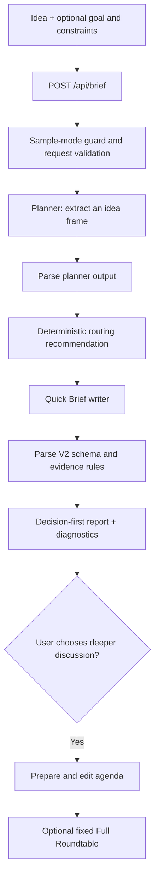

# AI Roundtable — Bounded AI Decision Briefs

[](https://github.com/96528025/ai-roundtable/actions/workflows/ci.yml)

**A full-stack application that turns a product idea into a structured decision about what to validate or build next.** The default Quick Brief uses a Planner and a brief writer to return a verdict, narrow MVP, risks, and a seven-day validation plan. An optional Full Roundtable preserves the original five-persona, three-round discussion workflow.

[Open the sample demo](https://ai-roundtable-mu.vercel.app) · [Inspect the committed evaluation](evals/results/latest.json) · [Browse workflow code](lib/v2/quick-brief.ts)

**Stack:** Next.js 15, React 19, TypeScript, Node.js Route Handlers, server-side Anthropic Messages API calls, Vitest, Playwright, axe-core, and GitHub Actions. The lockfile pins the installed versions; Next.js is declared as `^15.5.25`.

The project demonstrates **full-stack product engineering, bounded model orchestration, runtime validation, failure handling, and evaluation-informed design**. The public demo is sample-only: it displays committed examples and refuses model-backed execution on the server.

## Engineering highlights

| Capability | Implementation | Evidence |
| --- | --- | --- |
| Bounded model work | Quick Brief shares a four-attempt budget across transport retries and malformed-output recovery | [`budget.ts`](lib/v2/budget.ts), [`quick-brief.ts`](lib/v2/quick-brief.ts) |
| Explicit evidence boundaries | Runtime parsers require `not_researched`, no external sources/evidence claims, an evidence-gap flag, and no high-confidence claims/verdict | [`contract-schema.ts`](lib/v2/contract-schema.ts) |
| Resilient model transport | Typed upstream errors, bounded retries, request IDs, timeout covering headers and response-body reads | [`claude.ts`](lib/claude.ts), transport tests |
| Resilient browser flow | Cancellation, request identities, full response parsing, focus handling, safe retry/error UI | [`page.tsx`](app/page.tsx), [`api-client.ts`](lib/api-client.ts), browser tests |
| Measured workflow tradeoff | Five paired cases exposed substantial token/latency overhead without a difference on the structural rubric | [`evals/results/latest.json`](evals/results/latest.json) |
| No-key demo | Server guard rejects all three model-backed POST routes in sample mode | [`validation.ts`](lib/v2/validation.ts), API route tests |

## Product modes

| | Quick Brief — default | Full Roundtable — optional |
| --- | --- | --- |
| Input | Idea, optional decision goal, up to five constraints | Idea, Startup or General panel, approved three-to-five-topic agenda |
| Normal workflow | Planner → brief writer | Five fixed personas × three sequential rounds → moderator |
| Normal model work | Two calls | 16 logical calls after agenda approval; agenda generation is separate |
| Retry boundary | At most four model-call attempts and 8,400 requested output-token ceilings across attempts | Per-call transport retries plus up to three moderator synthesis samples; no shared four-attempt budget |
| Result | V2 decision brief, planner frame, routing recommendation, budget and diagnostics | Summary, consensus/disagreements, risks, next step, full transcript and diagnostics |
| Research | No external research | No external research/tool execution |
| Persistence | No saved Quick Brief history | Best-effort local JSON history, newest 50 meetings |

The Full personas are prompt-defined roles using the same provider integration. They are not independent services, different model providers, or dynamically selected specialists. Later turns see the growing transcript, including earlier turns from the same round.

## Quick Brief request flow



1. **Validate input.** Ideas must be 10–5,000 characters after trimming; goals are limited to 1,000 characters; at most five non-empty constraints of up to 300 characters are accepted.
2. **Plan.** The Planner extracts the target user, problem, workaround, assumptions, unknowns, risks, and routing signals with a 1,200-token output ceiling. Its attempts reserve capacity for the writer. Malformed output may be resampled once if budget remains. If Planner parsing still fails with `INVALID_MODEL_RESPONSE`, the workflow uses a conservative deterministic fallback frame and marks `planning.status: "fallback"`; transport/configuration failures do not silently become a valid plan.
3. **Recommend a route.** Code interprets the Planner's signals and can recommend deeper discussion, but `selectedPath` stays `quick`. A recommendation never starts paid Full execution automatically.
4. **Write and parse.** The writer requests up to 3,000 output tokens, and malformed output may be resampled once if capacity remains. Server and browser parsers validate the response before it is displayed.
5. **Present a decision.** The UI leads with the verdict and action plan, with planner details, evidence gaps, diagnostics, and legacy transcript available afterward.

The 8,400 limit sums **requested output ceilings**, including retries; it is not a cap on input tokens, total billable tokens, or dollars. Actual reported input/output usage appears in diagnostics. The four-attempt budget is an upper bound, not a promise that every failure path uses all remaining attempts.

## What a Quick Brief contains

- Idea summary; a calibrated verdict and rationale.
- Target user, problem, current workaround, assumptions, and unanswered questions.
- Unresearched alternatives labelled as user input or inference.
- Differentiation opportunities, MVP must-haves/exclusions, platform recommendation, and technical approach.
- Distribution/activation hypothesis, monetization outlook, material risks, and cheap tests.
- A seven-day validation plan with decision thresholds and one high-impact follow-up question.

The current contract requires `evidence.status: "not_researched"`, empty external sources, and no externally verified claims or high-confidence verdicts. This enforces honest labels and relationships between fields; schema validation does not independently fact-check the generated prose or prove that a recommendation is useful.

## Run locally

Use Node.js 22 to match CI, then install from the lockfile:

```bash
npm ci
```

For a sample-only local experience, create `.env.local` containing:

```dotenv
NEXT_PUBLIC_DEMO_MODE=sample
```

```bash
npm run dev
```

Open `http://localhost:3000`. Sample mode returns `403 LIVE_MODE_DISABLED` from `/api/brief`, `/api/agenda`, and `/api/roundtable` before a model call, even if a provider key is configured. The public demo uses this mode. `.vercelignore` excludes `.env*` files from deployment uploads.

For local model-backed use, remove the sample-mode setting and configure server environment variables in `.env.local`, then restart the app:

```dotenv
ANTHROPIC_API_KEY=your_api_key_here
ANTHROPIC_MODEL=claude-sonnet-4-6
ANTHROPIC_TIMEOUT_MS=60000
ANTHROPIC_MAX_RETRIES=2
ANTHROPIC_RETRY_BASE_DELAY_MS=500
```

Live execution uses your provider account. The model string above is the code's default, not a guarantee of account access. Without a key, the interactive UI's **View sample** path remains usable. The Quick Brief budget disables nested transport retries and manages retries itself; `ANTHROPIC_MAX_RETRIES` applies to ordinary transport calls such as the legacy workflow.

Production-shaped local run:

```bash
npm run build
npm start
```

## API and error handling

All three routes use the Node.js runtime and return JSON rather than streamed tokens.

| Endpoint | Request | Result |
| --- | --- | --- |
| `POST /api/brief` | `{ "idea": "...", "goal": "...", "constraints": ["..."] }` | `frame`, `planning`, `route`, `brief`, `budget`, `diagnostics` |
| `POST /api/agenda` | `{ "idea": "...", "panelMode": "startup" }` | Editable three-to-five-topic agenda; fixed fallback if model generation fails |
| `POST /api/roundtable` | `{ "idea": "...", "panelMode": "startup", "topics": ["User pain", "MVP scope", "Risks"] }` | Fixed discussion transcript, moderator summary, diagnostics |

The agenda route can return a fallback agenda after a provider error. Approval of an agenda therefore does not establish that provider execution succeeded. Full mode validates its agenda before starting the discussion.

| Failure category | HTTP status |
| --- | ---: |
| Invalid request/idea/agenda | 400 |
| Sample-mode execution guard | 403 |
| Provider rate limit after retries | 429 |
| Missing configuration, overload, or budget exhaustion | 503 |
| Provider/request timeout | 504 |
| Other upstream, authentication, network, or malformed model output error | 502 |
| Unexpected internal failure | 500 |

Public errors carry bounded text, a known code, retryability, and an upstream request ID when available. The client validates error/success bodies, maps service failures to fixed UI copy, and displays **Try again** only for retryable failures. Cancellation discards stale browser results; it does not abort server work already running or guarantee that model cost stops.

Transport defaults to a 60-second timeout per attempt, bounded exponential retries, and `Retry-After` handling. The deadline covers response-body consumption as well as waiting for headers. There is no single workflow-wide elapsed-time deadline.

## Evaluation: what changed and what the evidence supports

The committed August 4 baseline compares the legacy fixed roundtable with a **one-call control**, using five paired ideas and the same `claude-sonnet-4-6` model:

| Measure | Fixed roundtable | One-call control |
| --- | ---: | ---: |
| Mean shared structural brief score | 100 | 100 |
| Cases passing that rubric | 5 / 5 | 5 / 5 |
| Model-call attempts per case | 16 | 1 |
| Total tokens across five cases | 183,189 | 4,831 |
| Total duration across five cases | 684.8 s | 97.5 s |

Dividing aggregate totals gives **37.9× tokens and 7.0× duration** for the roundtable. The artifact separately records mean per-case ratios of 38.1× and 7.1×.

These results motivated a cheaper default workflow and retaining Full as an opt-in baseline. They do **not** measure the current two-call Quick Brief's savings or prove equal decision quality: all ten runs saturated the structural rubric, and no blinded human usefulness scores were collected. The result records commit `8c353bb` with `dirty: true`; the uncommitted diff was not preserved, so exact run reconstruction is unavailable.

The V2 evaluation harness compares Direct Brief, Planned Quick Brief, and Full on the same cases. It checks structural proxies such as evidence honesty, MVP scope, testable risks, thresholds, and follow-up impact; human usefulness remains `not_collected`. Output is written separately to `evals/results/v2-latest.json`, including missing cases/completion status. An implemented harness is not a measured V2 result.

Live evaluations are opt-in and incur provider usage:

```bash
npm run eval:smoke
npm run eval
npm run eval:v2:smoke
npm run eval:v2
```

See the [baseline artifact](evals/results/latest.json) and [moderator truncation investigation](docs/2026-08-04-moderator-truncation.md) for methodology and limitations.

## Tests and observability

Deterministic checks require no live model traffic:

```bash
npm run typecheck
npm run lint
npm test
npm run test:browser:install
npm run test:browser
npm run build
```

| Layer | Coverage | Boundary |
| --- | --- | --- |
| Vitest | Runtime contracts, budgets, transport/errors, stubbed route handlers, display samples, evaluation helpers, palette contrast | Model transport is stubbed; live evals are opt-in |
| Playwright / Chromium | Production-built UI, keyboard/focus flow, cancellation, stale results, retry, layouts at 1280/880/390 px | Page-originated API requests are mocked; this is browser integration, not a live-model end-to-end test |
| Server guard | Unmocked request to the test server returns `503 SERVICE_CONFIGURATION` | Confirms no provider credentials in that test server |
| axe-core | Automated scans across form/loading/result/error and smaller viewport states | Does not establish WCAG conformance; translucent panel contrast also needs review, with representative palette pairs checked separately |

[CI](.github/workflows/ci.yml) runs typecheck, lint, test, and build jobs on Node 22, without provider credentials or live evaluations.

Each workflow records a run ID. Model-call logs record stage, attempt, latency, retry delay, model, token usage, stop reason, and coarse errors/request IDs. Operational logs exclude prompts and generated content. Separately, successful Full runs attempt to save the original idea and result to `data/meetings.json`, keeping the newest 50; this best-effort local file is neither concurrency-safe durable storage nor serverless persistence.

## Current scope

There is no external research, RAG/retrieval layer, dynamic persona selection, parallel expert analysis, streamed progress, durable checkpoint/resume, authentication, user isolation, or durable decision-history database. LangGraph is not used. The public deployment is sample-only; local live execution must be explicitly configured.

Possible extensions include controlled source retrieval, more discriminating/blinded evaluation, adaptive expert selection, and durable decision history. These are future work, not current product capabilities.

## Code guide

| Path | Responsibility |
| --- | --- |
| [`app/page.tsx`](app/page.tsx), [`app/quick-brief-report.tsx`](app/quick-brief-report.tsx) | Product flow, request identity, result presentation |
| [`app/api`](app/api) | Quick Brief, agenda, and Full HTTP boundaries |
| [`lib/v2/quick-brief.ts`](lib/v2/quick-brief.ts), [`planner.ts`](lib/v2/planner.ts), [`budget.ts`](lib/v2/budget.ts) | Bounded orchestration, fallback, routing signals |
| [`lib/v2/contract-schema.ts`](lib/v2/contract-schema.ts), [`lib/api-client.ts`](lib/api-client.ts) | Shared runtime parsers and browser response/error handling |
| [`lib/claude.ts`](lib/claude.ts) | Provider transport, timeout, retries, typed errors |
| [`lib/debate.ts`](lib/debate.ts), [`lib/history.ts`](lib/history.ts) | Fixed legacy orchestration and local history |
| [`evals`](evals), [`tests`](tests) | Evaluation harnesses, committed evidence, offline and browser checks |
| [`docs`](docs) | Decisions and failure investigations |
