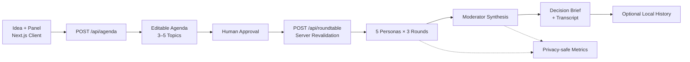

# AI Roundtable

> Turn one idea into a structured debate—and the debate into an actionable decision brief.

AI Roundtable is a human-approved, persona-based deliberation prototype for evaluating product ideas, startup concepts, and personal decisions. Instead of asking one model for a generic opinion, it prepares an editable agenda, runs five complementary perspectives through a shared three-round discussion, and produces a structured decision brief.

The interface presents the brief first while keeping the complete discussion and privacy-safe run diagnostics available for inspection.

## Key Features

- **Human-approved agenda** — generates 3–5 proposed topics, then requires the user to edit and approve them before the model-intensive workflow begins.
- **Two advisory panels** — offers a startup-validation panel and a general-advisory panel with different specialist perspectives.
- **Three-stage deliberation** — moves from independent positions to named cross-responses and revised final recommendations.
- **Accumulated discussion context** — every turn receives the transcript produced so far, allowing later agents to engage with earlier arguments.
- **Structured moderator synthesis** — returns consensus, disagreements, risks, a concrete next step, and a follow-up question.
- **Privacy-safe diagnostics** — records run ID, stage, latency, model, token usage, and error category without logging the idea, prompts, or transcript.
- **Bounded cost and failure handling** — caps idea input at 5,000 characters and retries transient connection, rate-limit, and 5xx failures with bounded exponential backoff.
- **Paired quality evaluation** — compares the 16-call roundtable with a one-call control using the same model, idea, agenda, output contract, and output-only scoring rubric, while separately checking roundtable orchestration integrity.
- **No-key sample brief** — lets a reviewer inspect a complete illustrative result without an Anthropic API key or a paid model call.

## How It Works

1. The user enters an idea containing 10–5,000 characters and chooses an advisory panel. The browser shows a character counter, and both API routes independently enforce the same limit.
2. `POST /api/agenda` asks Claude for 3–5 decision-relevant topics. If model access is unavailable or the response is malformed, the endpoint returns a predefined editable agenda.
3. The user edits, removes, adds, and explicitly approves the agenda.
4. `POST /api/roundtable` independently validates the submitted agenda: 3–5 distinct, non-empty topics with a maximum length of 160 characters each.
5. Five panel-specific personas respond sequentially across three rounds. Rounds 2 and 3 require each persona to engage with a previous agent by name.
6. A moderator receives the original idea, approved agenda, and complete transcript, then returns a typed decision brief.
7. The completed result is returned even if optional local-history persistence fails.

A model-generated agenda plus a complete roundtable normally uses **17 sequential Anthropic API requests**: one agenda request, 15 persona turns, and one moderator synthesis. The roundtable endpoint itself uses 16 logical model calls. Transient retries can increase the number of HTTP attempts, and every attempt appears in diagnostics. Sequential execution preserves deterministic speaking order and gives every new turn access to the accumulated discussion.

## Architecture



Key design choices:

- **Trust boundary:** the client owns agenda review, but the roundtable route treats client input as untrusted and revalidates it before any paid workflow begins.
- **Separate synthesis stage:** deliberation remains distinct from the user-facing report so the moderator can preserve disagreement instead of flattening all opinions.
- **Typed and runtime-checked contracts:** shared TypeScript types align the API and UI, while runtime validation rejects malformed agenda and moderator output.
- **Progressive disclosure:** the decision brief appears first; the 15-turn transcript and diagnostics remain inspectable.
- **Best-effort local persistence:** history supports local exploration but cannot invalidate an otherwise successful result if filesystem writes fail.

## Tech Stack

| Layer | Technology |
| --- | --- |
| Frontend | React 19, Next.js 15 App Router, CSS |
| Backend | Next.js Route Handlers with the Node.js runtime |
| Language | TypeScript with strict type checking |
| Model integration | Anthropic Messages API via server-side `fetch` |
| Testing | Vitest |
| Persistence | Optional bounded local JSON history |

## Getting Started

Install dependencies:

```bash
npm install
```

Create `.env.local` in the project root:

```bash
ANTHROPIC_API_KEY=your_api_key_here
ANTHROPIC_MODEL=claude-sonnet-4-6
ANTHROPIC_TIMEOUT_MS=60000
ANTHROPIC_MAX_RETRIES=2
ANTHROPIC_RETRY_BASE_DELAY_MS=500
```

These settings are optional except for `ANTHROPIC_API_KEY`. The current defaults are `claude-sonnet-4-6`, a 60-second timeout per attempt, two retries, and a 500ms exponential-backoff base. Pin an explicit model ID so evaluation results remain reproducible.

Start the application:

```bash
npm run dev
```

Open [http://localhost:3000](http://localhost:3000). Select **View sample brief** to inspect the complete interface without configuring an API key. The sample is explicitly labeled as illustrative and is not presented as a live model result.

## API

### `POST /api/agenda`

Request:

```json
{
  "idea": "A browser extension that turns messy shopping tabs into a decision brief.",
  "panelMode": "startup"
}
```

Success response:

```json
{
  "idea": "A browser extension that turns messy shopping tabs into a decision brief.",
  "panelMode": "startup",
  "topics": ["User pain", "Differentiation", "MVP scope", "Trust", "Validation plan"],
  "diagnostics": {
    "runId": "...",
    "modelCallCount": 1,
    "successfulModelCalls": 1,
    "failedModelCalls": 0,
    "retryCount": 0
  }
}
```

If agenda generation fails, the endpoint returns an editable fallback agenda. Diagnostics will show the failed call without exposing the input content.

### `POST /api/roundtable`

Request:

```json
{
  "idea": "A browser extension that turns messy shopping tabs into a decision brief.",
  "panelMode": "startup",
  "topics": ["User pain", "Differentiation", "MVP scope", "Trust", "Validation plan"]
}
```

Simplified success response:

```json
{
  "agenda": ["User pain", "Differentiation", "MVP scope", "Trust", "Validation plan"],
  "panelMode": "startup",
  "summary": {
    "executiveSummary": "...",
    "consensus": ["..."],
    "disagreements": ["..."],
    "risks": ["..."],
    "recommendedNextStep": "...",
    "followUpQuestion": "..."
  },
  "transcript": [
    { "round": 1, "agentName": "Customer Strategist", "content": "..." }
  ],
  "diagnostics": {
    "runId": "...",
    "durationMs": 12345,
    "modelCallCount": 16,
    "successfulModelCalls": 16,
    "failedModelCalls": 0,
    "retryCount": 0,
    "inputTokens": 1234,
    "outputTokens": 567,
    "models": ["configured-model-id"]
  }
}
```

Invalid input, missing configuration, upstream API failures, timeouts, empty model responses, and malformed moderator output return a structured error:

```json
{
  "error": "The AI service is rate-limited. Please try again shortly.",
  "code": "UPSTREAM_RATE_LIMIT",
  "retryable": true,
  "requestId": "req_..."
}
```

HTTP status codes preserve the failure boundary:

| Failure | Status |
| --- | ---: |
| Invalid JSON, idea, or agenda | `400` |
| Anthropic rate limit after retries | `429` |
| Missing server configuration or temporary overload | `503` |
| Anthropic timeout after retries | `504` |
| Upstream authentication, request, network, or 5xx failure | `502` |
| Unexpected internal failure | `500` |

Transient connection errors, `429`, `500–599`, and Anthropic `529` responses are retried up to two times by default. Retries use bounded exponential backoff with jitter and honor `retry-after` when Anthropic supplies it. Authentication, validation, empty-response, and malformed-report failures are not retried.

## Observability and Privacy

Every agenda or roundtable workflow receives a unique run ID. Each model call emits a structured server log with:

- workflow and stage name
- success or failure for every attempt
- attempt number, retry delay, upstream status, and request ID when available
- duration in milliseconds
- resolved model name
- input and output token counts when provided by Anthropic
- coarse error category such as configuration, timeout, network, authentication, rate limit, upstream, or empty response

The logs intentionally exclude the user's idea, system prompt, messages, model output, and transcript. Successful roundtable responses include aggregate diagnostics so the UI and API consumer can inspect latency and usage without accessing server logs.

## Evaluation

Run deterministic unit and evaluator tests without calling a model:

```bash
npm test
```

Run one paired live case as a smoke test:

```bash
npm run eval:smoke
```

Run all five paired cases:

```bash
npm run eval
```

Live evaluations load `.env.local` when `ANTHROPIC_API_KEY` is not already exported. Each paired case runs one single-pass control followed by the complete 16-call roundtable, for 17 logical calls before retries. The five-case suite uses 85 logical calls and can take several minutes.

Every live run writes `evals/results/latest.json`. The baseline contains the model, timestamp, Git commit and dirty-state flag, separate multi-agent and single-pass brief scores, workflow-integrity score, latency, token usage, model-call ratio, and per-case checks. It intentionally excludes ideas beyond the committed case definitions, prompts, transcripts, and model-generated prose.

The comparison uses two layers:

- **Shared brief rubric:** scores both systems on executive-summary substance, evidence sections, disagreement preservation, actionability, and follow-up specificity.
- **Roundtable-only workflow rubric:** checks all 15 turns, named cross-agent engagement, summary completeness, disagreement preservation, and actionability.

These checks are transparent structural proxies, not proof that a recommendation is factually correct or useful. A human-labeled review remains necessary before making broad quality claims.

### Current paired smoke baseline

The committed baseline in `evals/results/latest.json` was generated on August 4, 2026 with `claude-sonnet-4-6` using the `consultant workflow` case.

| Measure | Multi-agent roundtable | Single-pass control | Ratio / delta |
| --- | ---: | ---: | ---: |
| Shared brief score | 100 | 100 | 0-point delta |
| Workflow-integrity score | 100 | Not applicable | Passed |
| Model-call attempts | 16 | 1 | 16.0× |
| Total tokens | 36,718 | 1,089 | 33.7× |
| Duration | 137.5 seconds | 25.6 seconds | 5.4× |

This one-case smoke test validates the orchestration and measurement pipeline, but it does **not** demonstrate a brief-quality advantage over one direct call. Both outputs saturated the current structural rubric. The remaining four cases and human review are required before claiming that the added deliberation cost improves decision quality.

The evaluator uses explicit, reviewable thresholds rather than claiming to measure subjective quality perfectly:

- all 15 expected round-agent turns are present and non-trivial
- at least 80% of round 2–3 turns mention another agent by name
- the final brief preserves at least one substantive disagreement
- all summary sections contain non-trivial content
- the recommended next step contains an action plus a numeric or time-bound constraint

## Project Structure

```text
app/page.tsx                        Human-approved workflow, sample, report, and diagnostics UI
app/api/agenda/route.ts             Agenda generation and fallback boundary
app/api/roundtable/route.ts         Validated orchestration and best-effort persistence boundary
evals/cases.ts                      Five fixed live evaluation scenarios
evals/roundtable.eval.test.ts       Opt-in model quality regression suite
lib/agents.ts                       Panel-specific persona definitions
lib/claude.ts                       Timed Anthropic client and error classification
lib/control.ts                      One-call comparison baseline
lib/debate.ts                       Validation, orchestration, and synthesis
lib/demo.ts                         Clearly labeled, no-key illustrative result
lib/errors.ts                       Typed application errors and HTTP response mapping
lib/evaluation.ts                   Deterministic quality checks and scoring
lib/history.ts                      Local JSON history capped at 50 meetings
lib/limits.ts                       Shared client/server input limits
lib/observability.ts                Privacy-safe run and model-call metrics
tests/                              Offline workflow and evaluator tests
types.ts                            Shared application and diagnostics contracts
```

## Current Scope

- This is a single-user prototype with fixed panel membership, speaking order, and round count.
- Model calls run sequentially; the interface does not stream intermediate results or recover a partially completed workflow.
- Local meeting history has no listing or reopening interface and is not durable on ephemeral serverless deployments.
- There is no authentication or user isolation, and prompts are processed by Anthropic rather than on-device.
- The evaluator checks explicit behavioral proxies; it does not replace human review for factuality, safety, or decision quality.
- The repository includes a self-contained sample but does not by itself provide a hosted deployment URL.

## Future Improvements

- Persist per-stage state so interrupted workflows can resume without repeating completed model calls.
- Stream round and persona progress to the interface.
- Replace local JSON storage with database-backed, user-specific meeting history.
- Add authentication, retention controls, and a user-facing deletion workflow.
- Add human-labeled eval cases for factual faithfulness, agenda coverage, and decision usefulness.

## Validation

```bash
npm run typecheck
npm run lint
npm test
npm run build
```
